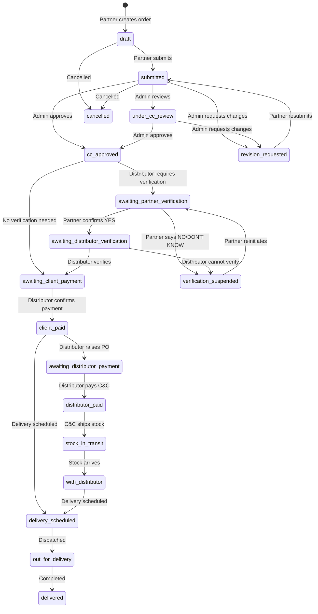

# Private Client Orders (PCO) Module
## Process Flow Documentation Pack

**Version:** 1.0
**Last Updated:** January 2026
**Module Owner:** Craft & Culture Operations

---

## Table of Contents

1. [Executive Summary](#1-executive-summary)
2. [System Overview](#2-system-overview)
3. [Order Status Lifecycle](#3-order-status-lifecycle)
4. [Process Flow Diagrams](#4-process-flow-diagrams)
5. [Role-Based Workflows](#5-role-based-workflows)
6. [Pricing & Calculations](#6-pricing--calculations)
7. [Document Management](#7-document-management)
8. [Verification Flows](#8-verification-flows)
9. [Notifications](#9-notifications)
10. [Status Reference](#10-status-reference)

---

## 1. Executive Summary

The Private Client Orders (PCO) module enables Wine Partners to place orders on behalf of their end clients, with Craft & Culture (C&C) acting as the supply chain orchestrator and Distributors handling final delivery and payment collection.

### Key Stakeholders

| Role | Description | Primary Actions |
|------|-------------|-----------------|
| **Wine Partner** | Brings clients and stock requests | Create orders, submit for review, manage client relationships |
| **C&C Admin** | Central operations team | Review orders, approve/revise, assign distributors, manage stock |
| **Distributor** | Local delivery partner (e.g., City Drinks, The Bottle Store) | Verify clients, collect payments, deliver stock |

### High-Level Flow

```
Partner Creates Order → C&C Reviews → C&C Approves → Distributor Assigned →
Verification (if required) → Client Payment → Distributor Payment →
Stock Ships → Delivery → Complete
```

---

## 2. System Overview

### 2.1 Order Numbering

Orders are assigned sequential numbers in format: `PCO-{YEAR}-{SEQUENCE}`

Example: `PCO-2026-0042`

### 2.2 Key Entities

| Entity | Description |
|--------|-------------|
| `privateClientOrders` | Main order record |
| `privateClientOrderItems` | Line items (wines) |
| `privateClientOrderDocuments` | Attached documents (invoices, payment proofs) |
| `privateClientOrderActivityLogs` | Audit trail of all actions |
| `privateClientContacts` | Client contact database |

### 2.3 Stock Sources

| Source | Description |
|--------|-------------|
| `cc_inventory` | Stock already in C&C warehouse |
| `partner_airfreight` | Stock to be airfreighted by partner |
| `partner_local` | Local stock from partner |
| `manual` | Manually specified source |

---

## 3. Order Status Lifecycle

### 3.1 Complete Status List (21 Statuses)



### 3.2 Status Categories

| Category | Statuses | Owner |
|----------|----------|-------|
| **Draft Phase** | `draft` | Partner |
| **Review Phase** | `submitted`, `under_cc_review`, `revision_requested` | Admin |
| **Approval** | `cc_approved` | Admin |
| **Verification Phase** | `awaiting_partner_verification`, `awaiting_distributor_verification`, `verification_suspended` | Partner/Distributor |
| **Payment Phase** | `awaiting_client_payment`, `client_paid`, `awaiting_distributor_payment`, `distributor_paid`, `awaiting_partner_payment`, `partner_paid` | Distributor |
| **Fulfillment Phase** | `stock_in_transit`, `with_distributor` | Admin/Distributor |
| **Delivery Phase** | `scheduling_delivery`, `delivery_scheduled`, `out_for_delivery`, `delivered` | Distributor |
| **Terminal** | `delivered`, `cancelled` | - |

---

## 4. Process Flow Diagrams

### 4.1 Main Order Flow

```
┌─────────────────────────────────────────────────────────────────────────────┐
│                           PCO MAIN PROCESS FLOW                             │
└─────────────────────────────────────────────────────────────────────────────┘

    ┌──────────┐
    │  START   │
    └────┬─────┘
         │
         ▼
┌─────────────────┐
│  Partner creates│
│  draft order    │
│  (status: draft)│
└────────┬────────┘
         │
         ▼
┌─────────────────┐
│  Add line items │
│  + client info  │
└────────┬────────┘
         │
         ▼
┌─────────────────┐
│ Partner submits │
│ for review      │
│ (status:        │
│  submitted)     │
└────────┬────────┘
         │
         ▼
    ┌────────────┐
    │ C&C Admin  │
    │ Reviews    │
    └─────┬──────┘
          │
    ┌─────┴─────┐
    │           │
    ▼           ▼
┌───────┐   ┌────────────┐
│Approve│   │Request     │
│       │   │Revision    │
└───┬───┘   └─────┬──────┘
    │             │
    │             ▼
    │       ┌──────────────┐
    │       │Partner fixes │
    │       │& resubmits   │
    │       └──────┬───────┘
    │              │
    │◄─────────────┘
    │
    ▼
┌─────────────────┐
│  Admin assigns  │
│  distributor    │
│ (cc_approved)   │
└────────┬────────┘
         │
    ┌────┴────┐
    │         │
    ▼         ▼
┌───────┐ ┌────────────────┐
│ TBS   │ │ City Drinks    │
│ (No   │ │ (Requires      │
│ verif)│ │ verification)  │
└───┬───┘ └───────┬────────┘
    │             │
    │             ▼
    │       ┌──────────────────┐
    │       │ VERIFICATION     │
    │       │ FLOW (see 4.2)   │
    │       └────────┬─────────┘
    │                │
    │◄───────────────┘
    │
    ▼
┌─────────────────────┐
│ awaiting_client_    │
│ payment             │
│ (Payment ref        │
│  generated)         │
└──────────┬──────────┘
           │
           ▼
    ┌──────────────┐
    │ Client pays  │
    │ distributor  │
    └──────┬───────┘
           │
           ▼
┌─────────────────────┐
│ Distributor confirms│
│ payment received    │
│ (client_paid)       │
└──────────┬──────────┘
           │
           ▼
┌─────────────────────┐
│ Distributor raises  │
│ PO to C&C           │
│ (awaiting_          │
│  distributor_       │
│  payment)           │
└──────────┬──────────┘
           │
           ▼
┌─────────────────────┐
│ Distributor pays    │
│ C&C                 │
│ (distributor_paid)  │
└──────────┬──────────┘
           │
           ▼
┌─────────────────────┐
│ C&C ships stock     │
│ to distributor      │
│ (stock_in_transit)  │
└──────────┬──────────┘
           │
           ▼
┌─────────────────────┐
│ Stock arrives at    │
│ distributor         │
│ (with_distributor)  │
└──────────┬──────────┘
           │
           ▼
┌─────────────────────┐
│ Distributor         │
│ schedules delivery  │
│ (delivery_scheduled)│
└──────────┬──────────┘
           │
           ▼
┌─────────────────────┐
│ Out for delivery    │
│ (out_for_delivery)  │
└──────────┬──────────┘
           │
           ▼
┌─────────────────────┐
│ DELIVERED           │
│ (delivered)         │
└──────────┬──────────┘
           │
           ▼
    ┌──────────┐
    │   END    │
    └──────────┘
```

### 4.2 Verification Flow (City Drinks)

```
┌─────────────────────────────────────────────────────────────────────────────┐
│                        CLIENT VERIFICATION FLOW                             │
│              (For distributors requiring verification, e.g., City Drinks)   │
└─────────────────────────────────────────────────────────────────────────────┘

┌─────────────────────────┐
│ Distributor assigned    │
│ (requiresVerification   │
│  = true)                │
└───────────┬─────────────┘
            │
            ▼
┌─────────────────────────┐
│ Status: awaiting_       │
│ partner_verification    │
│                         │
│ Partner asked:          │
│ "Is client verified     │
│  with [Distributor]?"   │
└───────────┬─────────────┘
            │
      ┌─────┴─────────────────┐
      │                       │
      ▼                       ▼
┌───────────┐         ┌──────────────────┐
│ Partner   │         │ Partner says     │
│ says YES  │         │ NO / DON'T KNOW  │
└─────┬─────┘         └────────┬─────────┘
      │                        │
      ▼                        ▼
┌─────────────────────┐ ┌──────────────────────┐
│ Status: awaiting_   │ │ Status: verification_│
│ distributor_        │ │ suspended            │
│ verification        │ │                      │
│                     │ │ Partner must resolve │
│ Distributor checks  │ │ with client          │
│ their system        │ └──────────┬───────────┘
└──────────┬──────────┘            │
           │                       │
     ┌─────┴─────┐                 │
     │           │                 │
     ▼           ▼                 │
┌─────────┐ ┌─────────────┐        │
│VERIFIED │ │NOT VERIFIED │        │
└────┬────┘ └──────┬──────┘        │
     │             │               │
     │             ▼               │
     │      ┌──────────────┐       │
     │      │verification_ │       │
     │      │suspended     │◄──────┘
     │      │              │
     │      │Partner must  │
     │      │help client   │
     │      │get verified  │
     │      └──────┬───────┘
     │             │
     │             ▼
     │      ┌──────────────────┐
     │      │ Partner can      │
     │      │ reinitiate when  │
     │      │ client is ready  │
     │      └──────┬───────────┘
     │             │
     │             │ (loops back to
     │             │  partner verification)
     │             │
     ▼             │
┌─────────────────────┐
│ Status: awaiting_   │
│ client_payment      │
│                     │
│ Payment reference   │
│ generated:          │
│ {CODE}-{ORDER#}     │
└─────────────────────┘
```

### 4.3 Payment Flow

```
┌─────────────────────────────────────────────────────────────────────────────┐
│                            PAYMENT FLOW                                     │
└─────────────────────────────────────────────────────────────────────────────┘

┌───────────────────────────┐
│ awaiting_client_payment   │
│                           │
│ Payment Reference:        │
│ e.g., CD-PCO-2026-0042    │
└────────────┬──────────────┘
             │
             ▼
┌───────────────────────────┐
│ Distributor uploads       │
│ invoice for client        │
│ (Document: distributor_   │
│  invoice)                 │
└────────────┬──────────────┘
             │
             ▼
┌───────────────────────────┐
│ Partner acknowledges      │
│ invoice                   │
│ (partnerInvoice           │
│  AcknowledgedAt)          │
└────────────┬──────────────┘
             │
             ▼
┌───────────────────────────┐
│ Client pays distributor   │
│                           │
│ Distributor confirms      │
│ → status: client_paid     │
│ → clientPaidAt timestamp  │
└────────────┬──────────────┘
             │
             ▼
┌───────────────────────────┐
│ Distributor raises        │
│ Purchase Order to C&C     │
│                           │
│ → status: awaiting_       │
│   distributor_payment     │
└────────────┬──────────────┘
             │
             ▼
┌───────────────────────────┐
│ Distributor pays C&C      │
│                           │
│ → status: distributor_    │
│   paid                    │
│ → distributorPaidAt       │
└────────────┬──────────────┘
             │
             ▼
┌───────────────────────────┐
│ Ready for fulfillment     │
└───────────────────────────┘
```

### 4.4 Delivery Flow

```
┌─────────────────────────────────────────────────────────────────────────────┐
│                            DELIVERY FLOW                                    │
└─────────────────────────────────────────────────────────────────────────────┘

┌───────────────────────────┐
│ distributor_paid          │
│ (Payment complete)        │
└────────────┬──────────────┘
             │
             ▼
┌───────────────────────────┐
│ C&C prepares shipment     │
│ to distributor            │
│                           │
│ → status: stock_in_       │
│   transit                 │
│ → stockShippedAt          │
└────────────┬──────────────┘
             │
             ▼
┌───────────────────────────┐
│ Distributor confirms      │
│ stock receipt             │
│                           │
│ → status: with_           │
│   distributor             │
│ → stockReceivedAt         │
└────────────┬──────────────┘
             │
             ▼
┌───────────────────────────┐
│ Distributor contacts      │
│ client for delivery       │
│                           │
│ Contact attempts logged   │
└────────────┬──────────────┘
             │
             ▼
┌───────────────────────────┐
│ Schedule delivery         │
│                           │
│ → status: delivery_       │
│   scheduled               │
│ → scheduledDeliveryDate   │
└────────────┬──────────────┘
             │
             ▼
┌───────────────────────────┐
│ Dispatch for delivery     │
│                           │
│ Pre-condition: All items  │
│ must be at distributor    │
│                           │
│ → status: out_for_        │
│   delivery                │
│ → outForDeliveryAt        │
└────────────┬──────────────┘
             │
             ▼
┌───────────────────────────┐
│ Delivery confirmation     │
│                           │
│ Optional:                 │
│ - Signature capture       │
│ - Photo proof             │
│                           │
│ → status: delivered       │
│ → deliveredAt             │
└───────────────────────────┘
```

---

## 5. Role-Based Workflows

### 5.1 Wine Partner Workflow

```
┌─────────────────────────────────────────────────────────────────────────────┐
│                         WINE PARTNER WORKFLOW                               │
└─────────────────────────────────────────────────────────────────────────────┘

CAPABILITIES:
├── Create draft orders
├── Add/edit/remove line items (in draft/revision_requested)
├── Submit orders for C&C review
├── Respond to revision requests
├── Respond to verification prompts (if distributor requires it)
├── Acknowledge distributor invoices
├── View order status and activity logs
└── Reinitiate verification (when suspended)

STATUS TRANSITIONS:
├── draft → submitted (submit order)
├── revision_requested → submitted (resubmit after changes)
├── awaiting_partner_verification → awaiting_distributor_verification (YES)
├── awaiting_partner_verification → verification_suspended (NO/DON'T KNOW)
└── verification_suspended → awaiting_partner_verification (reinitiate)

WORKFLOW:

1. ORDER CREATION
   ┌────────────────────────────────────────┐
   │ Create new order                       │
   │ ├── Select or create client            │
   │ ├── Add client details (name, phone,   │
   │ │   email, address)                    │
   │ ├── Add delivery notes                 │
   │ └── Add partner notes                  │
   └────────────────────────────────────────┘
                      │
                      ▼
2. ADD LINE ITEMS
   ┌────────────────────────────────────────┐
   │ For each wine:                         │
   │ ├── Select product (from catalog)      │
   │ ├── Specify quantity (cases)           │
   │ ├── Set unit price (USD per case)      │
   │ └── Review line total                  │
   └────────────────────────────────────────┘
                      │
                      ▼
3. SUBMIT FOR REVIEW
   ┌────────────────────────────────────────┐
   │ Validations:                           │
   │ ├── Must have at least 1 item          │
   │ ├── Must have client name              │
   │ └── Status must be draft or            │
   │     revision_requested                 │
   └────────────────────────────────────────┘
                      │
                      ▼
4. WAIT FOR C&C DECISION
   ┌────────────────────────────────────────┐
   │ Possible outcomes:                     │
   │ ├── APPROVED → Wait for distributor    │
   │ │   assignment                         │
   │ └── REVISION REQUESTED → Make changes  │
   │     and resubmit                       │
   └────────────────────────────────────────┘
                      │
                      ▼
5. VERIFICATION (IF REQUIRED)
   ┌────────────────────────────────────────┐
   │ When distributor requires verification:│
   │ ├── Respond YES if client is verified  │
   │ ├── Respond NO/DON'T KNOW otherwise    │
   │ └── If suspended, help client get      │
   │     verified then reinitiate           │
   └────────────────────────────────────────┘
                      │
                      ▼
6. MONITOR ORDER PROGRESS
   ┌────────────────────────────────────────┐
   │ Track through:                         │
   │ ├── Payment stages                     │
   │ ├── Stock movement                     │
   │ ├── Delivery scheduling                │
   │ └── Final delivery confirmation        │
   └────────────────────────────────────────┘
```

### 5.2 C&C Admin Workflow

```
┌─────────────────────────────────────────────────────────────────────────────┐
│                           C&C ADMIN WORKFLOW                                │
└─────────────────────────────────────────────────────────────────────────────┘

CAPABILITIES:
├── View all orders across all partners
├── Review submitted orders
├── Request revisions (with reason)
├── Approve orders
├── Set stock source for each line item
├── Assign distributors
├── Override any status (emergency use)
├── Mark stock as shipped (stock_in_transit)
├── Cancel orders
└── View all activity logs

STATUS TRANSITIONS:
├── submitted/under_cc_review → cc_approved (approve)
├── submitted/under_cc_review → revision_requested (request revision)
├── cc_approved → awaiting_partner_verification (assign verifying distributor)
├── cc_approved → awaiting_client_payment (assign non-verifying distributor)
├── distributor_paid → stock_in_transit (ship stock)
└── Any status → cancelled (admin override)

WORKFLOW:

1. REVIEW SUBMITTED ORDERS
   ┌────────────────────────────────────────┐
   │ Review checklist:                      │
   │ ├── Verify client information          │
   │ ├── Check product availability         │
   │ ├── Validate pricing                   │
   │ └── Assess delivery feasibility        │
   └────────────────────────────────────────┘
                      │
           ┌─────────┴─────────┐
           │                   │
           ▼                   ▼
2a. APPROVE ORDER         2b. REQUEST REVISION
   ┌──────────────────┐      ┌──────────────────┐
   │ Set stock source │      │ Provide reason   │
   │ for each item:   │      │ for revision     │
   │ ├── cc_inventory │      │                  │
   │ ├── partner_     │      │ Partner notified │
   │ │   airfreight   │      │ to make changes  │
   │ └── partner_     │      └──────────────────┘
   │     local        │
   │                  │
   │ Set expected     │
   │ arrival dates    │
   └────────┬─────────┘
            │
            ▼
3. ASSIGN DISTRIBUTOR
   ┌────────────────────────────────────────┐
   │ Select appropriate distributor:        │
   │ ├── City Drinks (verification req.)    │
   │ ├── The Bottle Store (no verification) │
   │ └── Others as configured               │
   │                                        │
   │ System auto-determines next status:    │
   │ ├── If verification required →         │
   │ │   awaiting_partner_verification      │
   │ └── If no verification →               │
   │     awaiting_client_payment            │
   └────────────────────────────────────────┘
                      │
                      ▼
4. MONITOR PAYMENT CYCLE
   ┌────────────────────────────────────────┐
   │ Track:                                 │
   │ ├── Client payment to distributor      │
   │ └── Distributor payment to C&C         │
   └────────────────────────────────────────┘
                      │
                      ▼
5. SHIP STOCK
   ┌────────────────────────────────────────┐
   │ When distributor has paid:             │
   │ ├── Prepare shipment                   │
   │ ├── Mark as stock_in_transit           │
   │ └── Notify distributor                 │
   └────────────────────────────────────────┘
```

### 5.3 Distributor Workflow

```
┌─────────────────────────────────────────────────────────────────────────────┐
│                          DISTRIBUTOR WORKFLOW                               │
└─────────────────────────────────────────────────────────────────────────────┘

CAPABILITIES:
├── View orders assigned to them
├── Verify clients (if distributor requires verification)
├── Upload invoices
├── Confirm client payment received
├── Record payment to C&C
├── Confirm stock receipt
├── Schedule delivery
├── Dispatch for delivery
├── Mark orders as delivered
└── Log contact attempts with clients

STATUS TRANSITIONS:
├── awaiting_distributor_verification → awaiting_client_payment (verify)
├── awaiting_distributor_verification → verification_suspended (cannot verify)
├── awaiting_client_payment → client_paid (confirm payment)
├── client_paid → awaiting_distributor_payment (raise PO)
├── awaiting_distributor_payment → distributor_paid (confirm payment)
├── stock_in_transit → with_distributor (confirm receipt)
├── with_distributor → out_for_delivery (dispatch)
├── delivery_scheduled → out_for_delivery (dispatch)
└── out_for_delivery → delivered (confirm delivery)

WORKFLOW:

1. RECEIVE ASSIGNED ORDER
   ┌────────────────────────────────────────┐
   │ Notification received when C&C         │
   │ assigns order                          │
   │                                        │
   │ If verification required:              │
   │ → Wait for partner confirmation first  │
   └────────────────────────────────────────┘
                      │
                      ▼
2. VERIFY CLIENT (if required)
   ┌────────────────────────────────────────┐
   │ Check internal system for client       │
   │                                        │
   │ Options:                               │
   │ ├── VERIFIED → Proceed to payment      │
   │ └── NOT VERIFIED → Suspend order,      │
   │     partner must help client register  │
   └────────────────────────────────────────┘
                      │
                      ▼
3. UPLOAD INVOICE
   ┌────────────────────────────────────────┐
   │ Create and upload client invoice       │
   │                                        │
   │ Document type: distributor_invoice     │
   │                                        │
   │ Wait for partner acknowledgment        │
   └────────────────────────────────────────┘
                      │
                      ▼
4. COLLECT CLIENT PAYMENT
   ┌────────────────────────────────────────┐
   │ Client pays using reference:           │
   │ {DISTRIBUTOR_CODE}-{ORDER_NUMBER}      │
   │                                        │
   │ Prerequisites to confirm:              │
   │ ├── Invoice uploaded                   │
   │ └── Partner has acknowledged invoice   │
   │                                        │
   │ Confirm payment → client_paid          │
   └────────────────────────────────────────┘
                      │
                      ▼
5. PAY C&C
   ┌────────────────────────────────────────┐
   │ Raise PO to Craft & Culture            │
   │ → awaiting_distributor_payment         │
   │                                        │
   │ Make payment                           │
   │ → distributor_paid                     │
   └────────────────────────────────────────┘
                      │
                      ▼
6. RECEIVE STOCK
   ┌────────────────────────────────────────┐
   │ When C&C ships stock:                  │
   │ → Order becomes stock_in_transit       │
   │                                        │
   │ Confirm receipt:                       │
   │ → with_distributor                     │
   └────────────────────────────────────────┘
                      │
                      ▼
7. SCHEDULE & EXECUTE DELIVERY
   ┌────────────────────────────────────────┐
   │ Contact client to arrange delivery     │
   │ Log contact attempts                   │
   │                                        │
   │ Schedule delivery:                     │
   │ → delivery_scheduled                   │
   │                                        │
   │ Dispatch (requires all stock ready):   │
   │ → out_for_delivery                     │
   │                                        │
   │ Confirm delivery:                      │
   │ → delivered                            │
   │ Optional: signature & photo proof      │
   └────────────────────────────────────────┘
```

---

## 6. Pricing & Calculations

### 6.1 Order Totals Formula

```
┌─────────────────────────────────────────────────────────────────────────────┐
│                         PRICING CALCULATION                                 │
└─────────────────────────────────────────────────────────────────────────────┘

INPUTS (from assigned distributor):
├── Duty Rate (pcoDutyRate) - Default: 5%
├── VAT Rate (pcoVatRate) - Default: 5%
└── Logistics Cost per Case (logisticsCostPerCase) - Default: $60

CALCULATIONS:

1. SUBTOTAL
   ┌────────────────────────────────────────┐
   │ subtotalUsd = SUM(item.totalUsd)       │
   │                                        │
   │ Where item.totalUsd =                  │
   │   quantity × unitPriceUsd              │
   └────────────────────────────────────────┘

2. DUTY
   ┌────────────────────────────────────────┐
   │ dutyUsd = subtotalUsd × dutyRate       │
   │                                        │
   │ Example:                               │
   │ $10,000 × 0.05 = $500                  │
   └────────────────────────────────────────┘

3. VAT
   ┌────────────────────────────────────────┐
   │ vatUsd = (subtotalUsd + dutyUsd)       │
   │          × vatRate                     │
   │                                        │
   │ Example:                               │
   │ ($10,000 + $500) × 0.05 = $525         │
   └────────────────────────────────────────┘

4. LOGISTICS
   ┌────────────────────────────────────────┐
   │ logisticsUsd = caseCount               │
   │                × logisticsPerCase      │
   │                                        │
   │ Example (20 cases):                    │
   │ 20 × $60 = $1,200                      │
   └────────────────────────────────────────┘

5. TOTAL
   ┌────────────────────────────────────────┐
   │ totalUsd = subtotalUsd + dutyUsd       │
   │            + vatUsd + logisticsUsd     │
   │                                        │
   │ Example:                               │
   │ $10,000 + $500 + $525 + $1,200         │
   │ = $12,225                              │
   └────────────────────────────────────────┘
```

### 6.2 Rate Configuration by Distributor

| Distributor | Duty Rate | VAT Rate | Logistics/Case |
|-------------|-----------|----------|----------------|
| City Drinks | 5% | 5% | $60 |
| The Bottle Store | 5% | 5% | $60 |
| (Configurable per distributor in admin panel) |

### 6.3 When Totals Are Recalculated

- When line items are added/updated/removed
- When distributor is assigned or changed
- On any order update that affects items

---

## 7. Document Management

### 7.1 Document Types

| Type | Uploaded By | Required For | Description |
|------|-------------|--------------|-------------|
| `distributor_invoice` | Distributor | Confirming client_paid | Invoice sent to client |
| `payment_proof` | Distributor | Optional | Proof of payment received |
| `delivery_signature` | Distributor | Optional | Client signature on delivery |
| `delivery_photo` | Distributor | Optional | Photo proof of delivery |

### 7.2 Document Flow

```
┌─────────────────────────────────────────────────────────────────────────────┐
│                          DOCUMENT FLOW                                      │
└─────────────────────────────────────────────────────────────────────────────┘

1. INVOICE WORKFLOW
   ┌────────────────────────────────────────┐
   │ Status: awaiting_client_payment        │
   └────────────────┬───────────────────────┘
                    │
                    ▼
   ┌────────────────────────────────────────┐
   │ Distributor uploads invoice            │
   │ (distributor_invoice)                  │
   └────────────────┬───────────────────────┘
                    │
                    ▼
   ┌────────────────────────────────────────┐
   │ Partner acknowledges invoice           │
   │ (partnerInvoiceAcknowledgedAt)         │
   └────────────────┬───────────────────────┘
                    │
                    ▼
   ┌────────────────────────────────────────┐
   │ Now distributor can confirm payment    │
   └────────────────────────────────────────┘

2. DELIVERY PROOF
   ┌────────────────────────────────────────┐
   │ Status: out_for_delivery               │
   └────────────────┬───────────────────────┘
                    │
                    ▼
   ┌────────────────────────────────────────┐
   │ On delivery, optionally capture:       │
   │ ├── Client signature                   │
   │ └── Photo of delivered goods           │
   └────────────────┬───────────────────────┘
                    │
                    ▼
   ┌────────────────────────────────────────┐
   │ Mark as delivered with proof attached  │
   └────────────────────────────────────────┘
```

---

## 8. Verification Flows

### 8.1 Why Verification Exists

Some distributors (e.g., City Drinks) require clients to be registered in their system before they can process orders. This ensures:
- Client has a valid account with the distributor
- Payment can be properly tracked
- Delivery address is verified

### 8.2 Verification States

```
┌─────────────────────────────────────────────────────────────────────────────┐
│                      VERIFICATION STATE MACHINE                             │
└─────────────────────────────────────────────────────────────────────────────┘

                    ┌─────────────────────┐
                    │ cc_approved         │
                    │ (with verifying     │
                    │  distributor)       │
                    └──────────┬──────────┘
                               │
                               ▼
                    ┌─────────────────────┐
                    │ awaiting_partner_   │◄───────────────┐
                    │ verification        │                │
                    └──────────┬──────────┘                │
                               │                           │
              ┌────────────────┼────────────────┐          │
              │                │                │          │
              ▼                ▼                ▼          │
        ┌─────────┐     ┌───────────┐    ┌──────────┐     │
        │ YES     │     │ NO        │    │DON'T KNOW│     │
        └────┬────┘     └─────┬─────┘    └────┬─────┘     │
             │                │               │           │
             ▼                └───────┬───────┘           │
┌─────────────────────┐               │                   │
│ awaiting_distributor│               ▼                   │
│ _verification       │    ┌─────────────────────┐        │
└──────────┬──────────┘    │ verification_       │        │
           │               │ suspended           │────────┘
     ┌─────┴─────┐         │                     │ (reinitiate)
     │           │         │ Partner resolves    │
     ▼           ▼         │ with client         │
┌─────────┐ ┌─────────┐    └─────────────────────┘
│VERIFIED │ │NOT      │
│         │ │VERIFIED │
└────┬────┘ └────┬────┘
     │           │
     │           └─────► verification_suspended
     │
     ▼
┌─────────────────────┐
│ awaiting_client_    │
│ payment             │
└─────────────────────┘
```

### 8.3 Verification Responses

| Actor | Response Options | Next Status |
|-------|-----------------|-------------|
| Partner | YES | awaiting_distributor_verification |
| Partner | NO | verification_suspended |
| Partner | DON'T KNOW | verification_suspended |
| Distributor | VERIFIED | awaiting_client_payment |
| Distributor | NOT_VERIFIED | verification_suspended |

---

## 9. Notifications

### 9.1 Notification Types

| Type | Sent To | Trigger |
|------|---------|---------|
| `action_required` | Partner | Verification prompt |
| `action_required` | Distributor | Client verification needed |
| `revision_requested` | Partner | Admin requests changes |
| `status_update` | Partner | Order status changes |
| `status_update` | Partner | Client verified |
| `status_update` | Partner | Verification failed |
| `status_update` | Partner | Delivery scheduled |
| `status_update` | Partner | Order delivered |
| `po_assigned` | Distributor | Order assigned to them |

### 9.2 Key Notification Triggers

```
┌─────────────────────────────────────────────────────────────────────────────┐
│                       NOTIFICATION TRIGGERS                                 │
└─────────────────────────────────────────────────────────────────────────────┘

1. ORDER ASSIGNED TO DISTRIBUTOR
   ├── If verification required → Notify Partner (action_required)
   └── If no verification → Notify Distributor (po_assigned)

2. PARTNER VERIFICATION RESPONSE
   ├── YES → Notify Distributor (action_required: verify client)
   └── NO/DON'T KNOW → Notify Partner team (status_update: suspended)

3. DISTRIBUTOR VERIFICATION RESPONSE
   ├── VERIFIED → Notify Partner (status_update: awaiting payment)
   └── NOT VERIFIED → Notify Partner (action_required: help client)

4. REVISION REQUESTED
   └── Notify Partner (revision_requested)

5. DELIVERY SCHEDULED
   └── Notify Partner (status_update)

6. ORDER DELIVERED
   └── Notify Partner (status_update)

7. ORDER IN TRANSIT
   └── Notify Partner (status_update)
```

---

## 10. Status Reference

### 10.1 Complete Status Table

| Status | Description | Owner | Next Statuses |
|--------|-------------|-------|---------------|
| `draft` | Order created, being edited | Partner | submitted, cancelled |
| `submitted` | Sent for C&C review | Admin | under_cc_review, cc_approved, revision_requested |
| `under_cc_review` | Admin reviewing | Admin | cc_approved, revision_requested |
| `revision_requested` | Changes needed from partner | Partner | submitted |
| `cc_approved` | Admin approved, ready for distributor | Admin | awaiting_partner_verification, awaiting_client_payment |
| `awaiting_partner_verification` | Partner must confirm client status | Partner | awaiting_distributor_verification, verification_suspended |
| `awaiting_distributor_verification` | Distributor checking their system | Distributor | awaiting_client_payment, verification_suspended |
| `verification_suspended` | Client not verified, needs resolution | Partner | awaiting_partner_verification |
| `awaiting_client_payment` | Waiting for client to pay distributor | Distributor | client_paid |
| `client_paid` | Client has paid distributor | Distributor | awaiting_distributor_payment, scheduling_delivery |
| `awaiting_distributor_payment` | Waiting for distributor to pay C&C | Distributor | distributor_paid |
| `distributor_paid` | Distributor has paid C&C | Admin | stock_in_transit |
| `awaiting_partner_payment` | (Legacy) Waiting for partner payment | - | partner_paid |
| `partner_paid` | (Legacy) Partner has paid | - | stock_in_transit |
| `stock_in_transit` | C&C shipped to distributor | Distributor | with_distributor |
| `with_distributor` | Stock at distributor warehouse | Distributor | delivery_scheduled, out_for_delivery |
| `scheduling_delivery` | Setting up delivery date | Distributor | delivery_scheduled |
| `delivery_scheduled` | Delivery date confirmed | Distributor | out_for_delivery |
| `out_for_delivery` | On the way to client | Distributor | delivered |
| `delivered` | Complete | - | (terminal) |
| `cancelled` | Order cancelled | - | (terminal) |

### 10.2 Status Timestamps

Each status transition records a timestamp:

| Field | Set When |
|-------|----------|
| `createdAt` | Order created |
| `submittedAt` | Partner submits |
| `ccApprovedAt` | Admin approves |
| `distributorAssignedAt` | Distributor assigned |
| `partnerVerificationAt` | Partner responds to verification |
| `distributorVerificationAt` | Distributor verifies |
| `clientPaidAt` | Client payment confirmed |
| `distributorPaidAt` | Distributor payment confirmed |
| `stockShippedAt` | Stock dispatched from C&C |
| `stockReceivedAt` | Distributor confirms stock receipt |
| `scheduledDeliveryDate` | Target delivery date |
| `scheduledDeliveryAt` | When delivery was scheduled |
| `outForDeliveryAt` | Dispatched for delivery |
| `deliveredAt` | Final delivery |

---

## Appendix A: Database Schema Reference

### Orders Table Fields

```sql
privateClientOrders
├── id (UUID)
├── orderNumber (PCO-YYYY-NNNN)
├── partnerId (FK → partners)
├── distributorId (FK → partners)
├── clientId (FK → privateClientContacts)
├── status (enum)
├── clientName, clientEmail, clientPhone, clientAddress
├── partnerNotes, distributorNotes, ccNotes, deliveryNotes
├── paymentReference
├── itemCount, caseCount
├── subtotalUsd, dutyUsd, vatUsd, logisticsUsd, totalUsd
├── revisionReason, revisionRequestedAt
├── partnerVerificationResponse, partnerVerificationAt
├── distributorVerificationResponse, distributorVerificationAt
├── partnerInvoiceAcknowledgedAt
├── scheduledDeliveryDate, deliverySignature, deliveryPhoto
└── [all timestamp fields]
```

### Line Items Table Fields

```sql
privateClientOrderItems
├── id (UUID)
├── orderId (FK → privateClientOrders)
├── productId (FK → products)
├── productName, productSku, productVintage
├── quantity (cases)
├── unitPriceUsd, totalUsd
├── source (cc_inventory, partner_airfreight, partner_local, manual)
├── stockStatus (pending, confirmed, in_transit, at_distributor)
├── stockExpectedAt, stockConfirmedAt
└── notes
```

---

## Appendix B: API Endpoints Reference

| Endpoint | Actor | Purpose |
|----------|-------|---------|
| `ordersCreate` | Partner | Create draft order |
| `ordersSubmit` | Partner | Submit for review |
| `itemsAdd/Update/Remove` | Partner | Manage line items |
| `ordersApprove` | Admin | Approve order |
| `ordersRequestRevision` | Admin | Request changes |
| `ordersAssignDistributor` | Admin | Assign delivery partner |
| `ordersPartnerVerification` | Partner | Respond to verification |
| `ordersDistributorVerification` | Distributor | Verify client |
| `distributorUpdateStatus` | Distributor | Update payment/delivery status |
| `ordersScheduleDelivery` | Distributor | Set delivery date |
| `ordersMarkInTransit` | Distributor | Mark dispatched |
| `ordersMarkDelivered` | Distributor | Complete delivery |
| `documentsUpload` | Any | Upload documents |
| `ordersPartnerAcknowledgeInvoice` | Partner | Acknowledge invoice |

---

**Document End**

*For technical implementation details, refer to:*
- `/apps/web/src/app/_privateClientOrders/` - Controllers and utilities
- `/apps/web/src/database/schema.ts` - Database schema definitions
